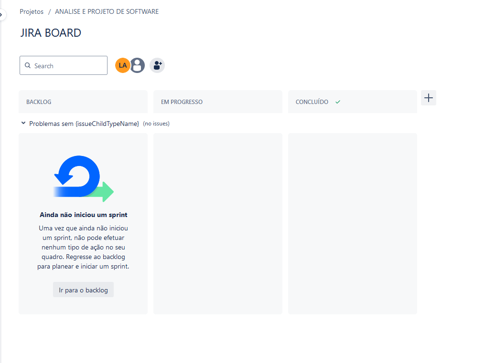
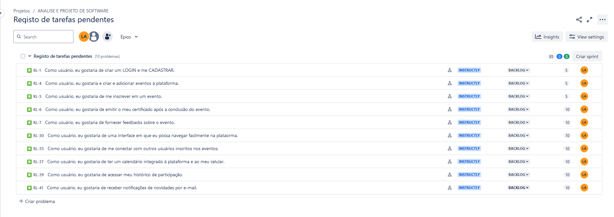

   

 

# UNIVERSIDADE CATÓLICA DE PERNAMBUCO

   
  

# ÍNDICE
* [Índice](#índice)
* [Descrição do Projeto](#descrição-do-projeto)
* [Desenvolvimento do Projeto](#desenvolvimento-do-projeto)
* [Funcionalidades e Demonstração da Aplicação](#funcionalidades-e-demonstração-da-aplicação)
* [Acesso ao Projeto](#acesso-ao-projeto)
* [Tecnologias utilizadas](#tecnologias-utilizadas)
* [Pessoas Contribuidoras](#pessoas-contribuidoras)
* [Pessoas Desenvolvedoras do Projeto](#pessoas-desenvolvedoras)
* [Licença](#licença)
* [Conclusão](#conclusão)

# DESCRIÇÃO DO PROJETO

INSTRUCTLYCAP é um projeto que está em desenvolvimento sob a disciplina de ANÁLISE E PROJETO DE SOFTWARE e que visa atender às necessidades específicas das instituições universitárias na organização e gestão de eventos acadêmicos e sociais. Inspirada em soluções como plataforma de gerenciamento de eventos, o projeto em desenvolvimento visa fornecer um sistema robusto e intuitivo para facilitar a administração de eventos, desde conferências e seminários até workshops e atividades extracurriculares para IES. Em suma, este projeto está sendo desenvolvido, implementado e testado para que seja eficiente e sirva como uma solução inovadora para a Universidade Católica de Pernambuco.

# DESENVOLVIMENTO DO PROJETO
### JIRA BOARD & BACKLOG
Abaixo, é possível visualizar imagens do BOARD e BACKLOG do desenvolvimento do projeto no JIRA. Pra maiores informações, acessar a [ESTRUTURA DO PROJETO]().

| IDEIA | INSTRUCTLYCAP                                                                                                                                               |
| :--: | ---------------------------------------------------------------------------------------------------------------------------------------------------------------- |
|  Centralização e Integração   | Criar um ponto único de acesso para todos os eventos da universidade.                                 |
|  Facilidade de Uso   | Oferecer uma interface amigável e intuitiva, projetada para usuários com diferentes níveis de experiência em tecnologia. |
|  Funcionalidades Específicas   | Atender às necessidades exclusivas das instituições de ensino superior.                    |
 ### BOARD JIRA
 Quadro do JIRA que, como é possível perceber, não há Sprints iniciadas. As histórias de usuários serão encontradas no quadro do backlog. Ao longo do desenvolvimento do projeto, Sprints serão criadas e implementadas de acordo com suas funcionalidades e critérios de aceitação das histórias de usuários.
     
   
  

  
### BACKLOG JIRA 

   Parte do Backlog do projeto. O backlog específica todas as funcionalidades e requisitos do software que serão implementados ao longo do desenvolvimento do projeto. Existem, como vimos, as hitsórias de usuários, suas substacks e seus critérios de aceitação, que serão os requisitos a serem implementados de acordo com a história de usuário escolhida e com base nos 3 C's (Cartão, Comnversa e Confirmação)

   
   

### SKETCHS & STORYBOARD 

A seguir, estarão anexados os SKETCHES E STORYBOARDS das cinco primeiras histórias de usuários.  
A primeira SKETCH abaixo refere-se à primeira história de usuário, que, em resumo, refere-se à criação da interface de cadastro e LOGIN da plataforma em desenvolvimento.    
   
### SKETCH & STORYBOARD 01

   
   

Dessa forma, todos os outros SKETCHES e STORYBOARDS seguirão a mesma formatação, sendo as numerações relacionadas às histórias de usuários.

### SKETCH & STORYBOARD 02

   
   

### SKETCH & STORYBOARD 03

   
   

### SKETCH & STORYBOARD 04

   
   

### SKETCH & STORYBOARD 05

   
   
   

### SCREENCAST (PROTÓTIPO) 

SCREENCAST DO PROTÓTIPO - InstructlyCAP  
A gestão eficiente de eventos acadêmicos e sociais é essencial para o bom funcionamento das instituições de ensino superior. É pensando nessa necessidade que a InstructlyCAP está sendo desenvolvida, uma plataforma projetada para otimizar e simplificar a administração de eventos em universidades. Neste SCREENCAST, exploramos o protótipo FIGMA do desenvolvimento desse projeto. É possível observar o protótipo de INTERFACE das páginas de CADASTRO de um evento e eventos universitários. Essas são as interfaces principais para o desenvolvimento inicial desse projeto. 
   
Para acessar este projeto no Figma, [clique aqui.](https://www.figma.com/proto/O2XD4ivdYnsiZH6sA1UrVT/A.D.S.-%7C-Project?node-id=5-81&t=igUQKOXjtAgmoqxz-1&starting-point-node-id=5%3A81)

   

### TECNOLOGIAS UTILIZADAS
As seguintes ferramentas estão atualmente sendo utilizadas na construção desse projeto:

- [Python 3.10](https://www.python.org/downloads/)
- [Pycharm Community JETBRAIN IDE](https://www.jetbrains.com/pycharm/)
- [Django Framework](https://www.djangoproject.com/start/)
- [SQLite DB Browser](https://www.sqlite.org/)
- [Bootstrap Framework](https://getbootstrap.com/)
